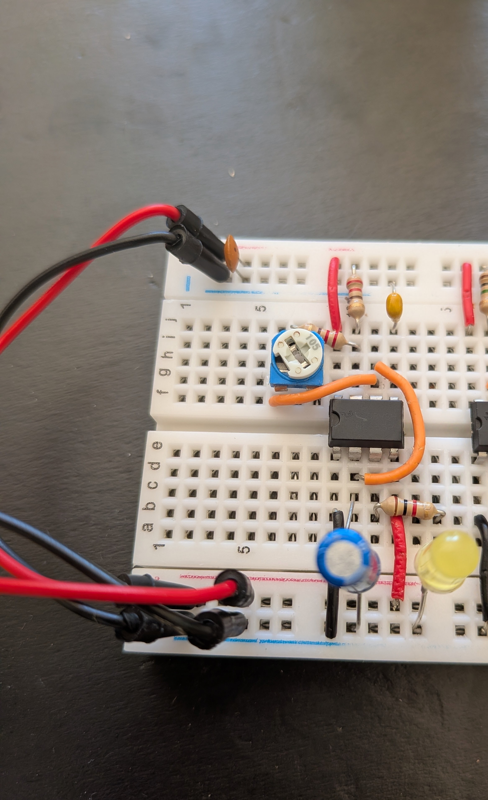
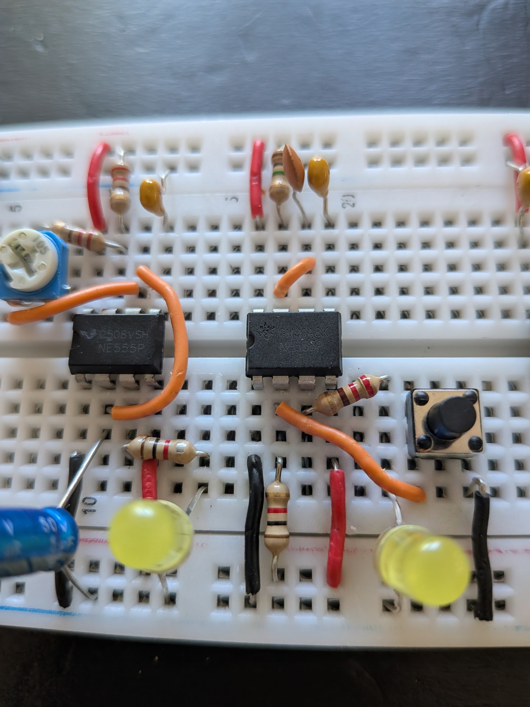
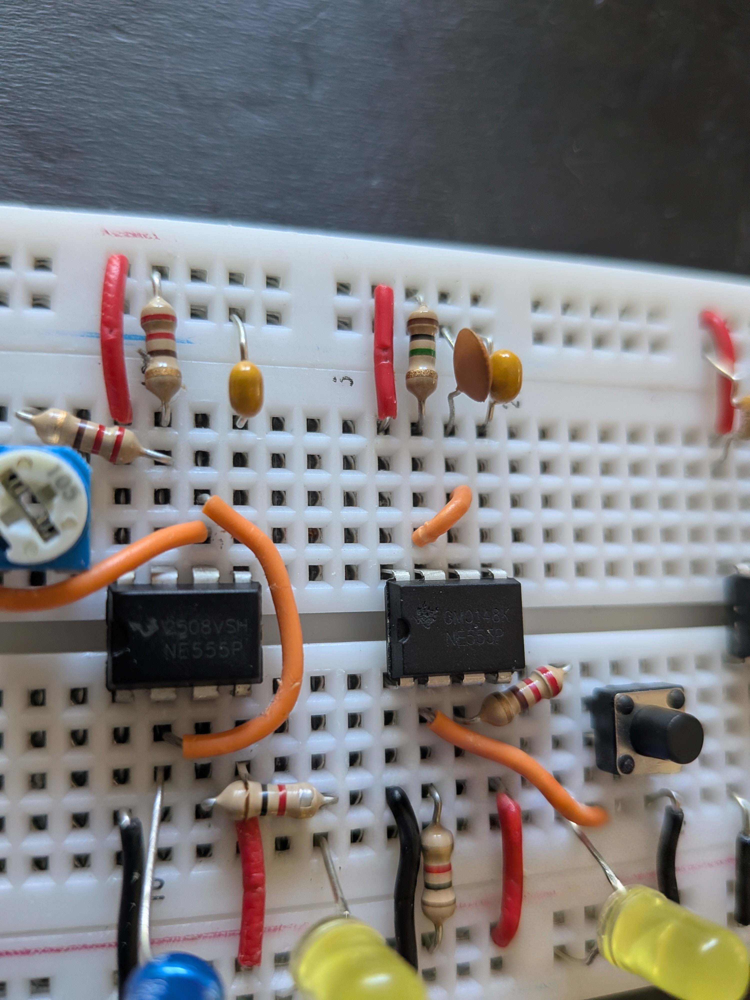

# Description

The goal of this project was to learn and tinker with electronics but also understand low-level CPU principles (basic ones).
I came accross Ben's project(s) and his amazing pedagogic work and kits allow to build knowledge from the ground up. 
I document here some info, schemas and pictures of the [8-Bit computer project](https://eater.net/8bit) which I followed using the series of [YT videos](https://youtu.be/kRlSFm519Bo?si=gK9NJFnHcegY1x9O) from Ben.
I also document a few references which allow to expand knowledge of the components used.

## Part 1 - The Clock 

*The computer's clock is used to synchronize all operations. The clock we're building is based on the popular 555 timer IC.* ([source](https://eater.net/8bit/clock))

### Part 1.1 - The astable circuit

*Astable means that it continuously changes state (on/off)*

The first "clock" is configured as an astable oscillator.

#### Circuit

#### Pictures of my breadboard

**Components not represented on the schema:**
- Resistors on potentiometer input/output (input is used to protect voltage short, and output is used to protect pin 7 from direct dicharge by the capacitor nearby)
- Ceramic Capacitors (one sits near power supply and the other one on the pin 5 of the 555 chip)

#### Small Tips

- Ben changes the circuit between the beginning of the video and the end, and explains why
- The components can slightly differs from Ben's videos (the potentiometer pins being offset vs inline) and therefore alters slightly your version of the clock
- Yellow LEDs require more voltage than red LEDs but less than blue ones, so changing the LED colour means you may need to adjust the resistor to prevent the LED from being too dim or burning out. See references for more in-depth understanding on diodes.
- The resistors you chose are important. They will either avoid burning your LEDs, chip or other components or they will control the "timing". 
- Feeling lost in the colours of your resistors? See [this](https://www.digikey.co.uk/en/resources/conversion-calculators/conversion-calculator-resistor-color-code)! 
  
### References

- Ben's 8-bit computer project - [8-Bit computer project](https://eater.net/8bit)
- 555 chip in-depth - https://www.instructables.com/555-Timer-IC/ and https://www.electronics-tutorials.ws/waveforms/555_timer.html
- [How resistors work](https://theengineeringmindset.com/how-resistors-work/)
- [How capacitors work](https://www.build-electronic-circuits.com/how-does-a-capacitor-work/)
- [How breadboards work](https://www.sciencebuddies.org/science-fair-projects/references/how-to-use-a-breadboard)
- [How current flow](https://www.albert.io/blog/how-does-electricity-flow/)
- [All about Leds](https://electronicsclub.info/leds.htm#:~:text=RGB%20LEDs%20contain,to%20limit%20the%20current.)
- [Light emitting diodes and physics behind it](https://en.wikipedia.org/wiki/Light-emitting_diode_physics)
- The e-shop for the kits - [eShop](https://eater.net/8bit/kits)
- [https://www.digikey.co.uk/en/resources/online-conversion-calculators](Online calculators for electronics)

### Part 2 - The monostable circuit

*Monostable means that it persists in a state until trigger*

#### Circuit

#### Pictures of my breadboard

